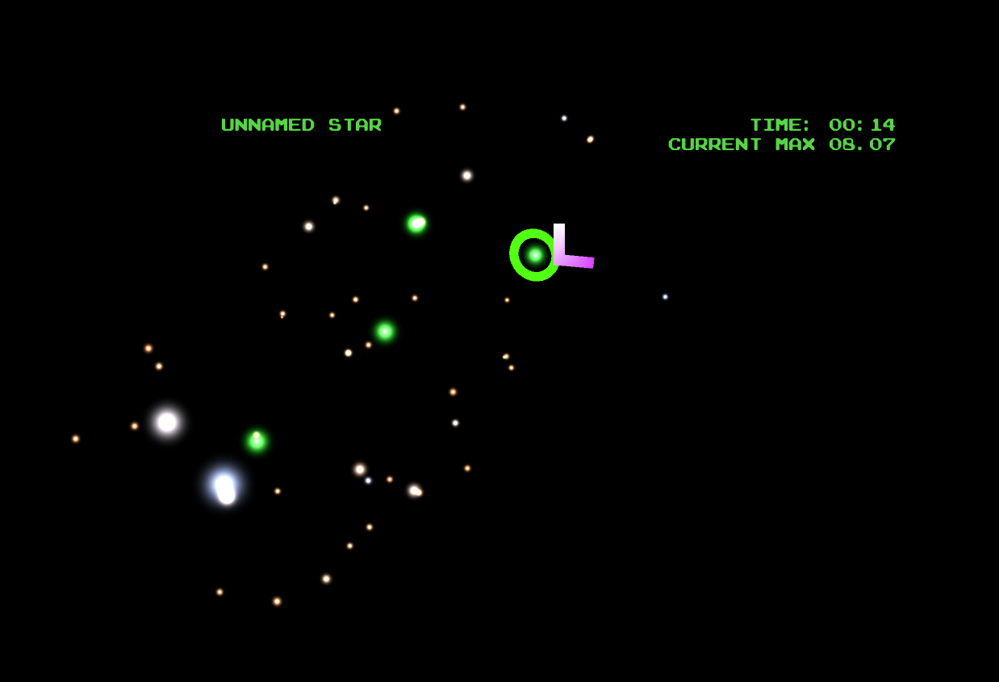

# starseeds

This small AR game was written for the Meta 2 headset by [Hannah Cairns](mailto:hannah.abigail.cairns@gmail.com).

Send little green ships from stars you control to ones that you don't. Try to get as far from Earth as possible. Do not get eaten by space.

Builds:

* build\starseeds_build_monitor
  * play the game in a regular window, should run on any windows machine
* build\starseeds_build_headset
  * play the game on a Meta 2 headset

## Gameplay

See https://colaprograms.github.io/starseeds, or open the file docs/index.html.

#### Controls

1. Select a green star with the chevron that is stuck to your head.
2. Hit the space bar, and select another star.
3. Let go of the space bar. A little green dot will travel slowly to the new star. It will become green, and more stars will be revealed in its neighbourhood, if there are any.
4. Repeat!

#### I want to see a screenshot!

Okay.

## Configuration

Colors and stuff can be configured by editing:

    build\starseeds_build_(whatever)\starseeds_build_(whatever)_data\StreamingAssets\Rezolve\config.cs

## Changing the Unity project between the headset and monitor

If you are editing the Unity project, here's how to switch between the headset and monitor.

*To get regular 3d:*

Enable Main Camera.  
Disable MetaCameraRig.  
On rezolve/reticle, disable the script "Meta Locking" and enable "Lock_to_camera".  
On distancepanels:
* disable the script "Meta Locking" and enable "Lock_to_camera_ii".
* enable the child object monitor
* disable the child object headset

Disable metainterface.

*To get the headset, do the opposite:*

Disable Main Camera.  
Enable MetaCameraRig.  
On rezolve/reticle, enable the script "Meta Locking" and disable "Lock_to_camera".  
On distancepanels:
* enable the script "Meta Locking" and disable "Lock_to_camera_ii".
* disable monitor
* enable headset

Enable metainterface.
