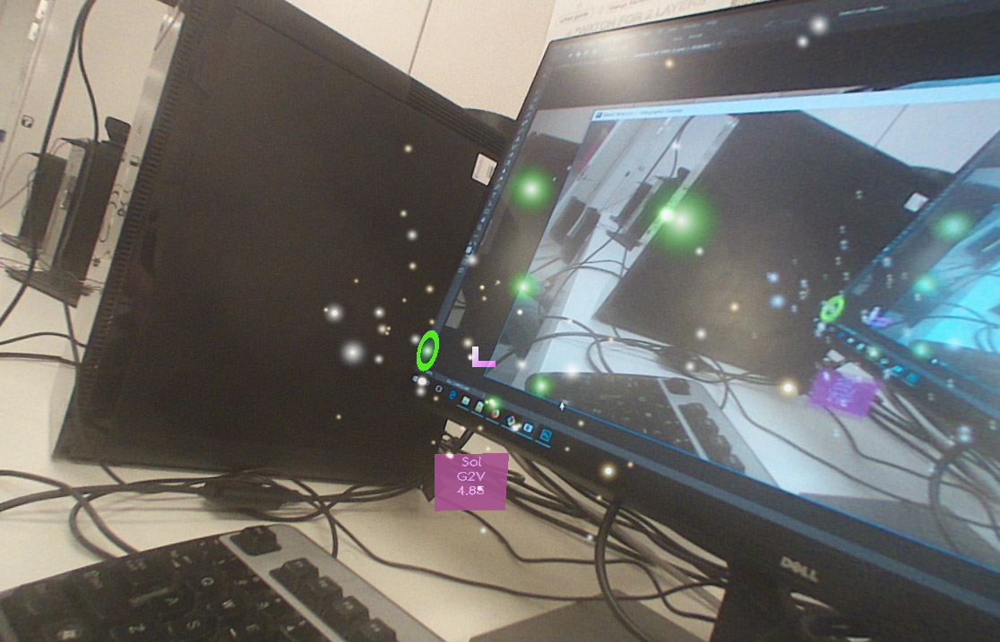

# starseeds

This small AR game was written for the Meta 2 headset by [Hannah Cairns](mailto:hannah.abigail.cairns@gmail.com).

Send little green ships from stars you control to ones that you don't, and then build new launchers. Try to get as far from Earth as possible. Avoid getting a virus.

It is not finished. See issues for status.

## Gameplay

#### Controls

1. Select a green star with the chevron that is stuck to your head.
2. Hit the space bar, and select another star.
3. Let go of the space bar. A little green dot will travel slowly to the new star. It will become green, and more stars will be revealed in its neighbourhood, if there are any.
4. Repeat!

#### I want to see a screenshot!

Okay.

## Switching between the headset and regular 3d on the monitor

To get regular 3d:

Enable Main Camera.  
Disable MetaCameraRig.  
On reticle, disable the script "Meta Locking" and enable "Lock_to_camera".  
On panels, disable the script "Meta Locking" and enable "Lock_to_camera_ii".

To get the headset, do the opposite:

Disable Main Camera.  
Enable MetaCameraRig.  
On reticle, enable the script "Meta Locking" and disable "Lock_to_camera".  
On panels, enable the script "Meta Locking" and disable "Lock_to_camera_ii".
